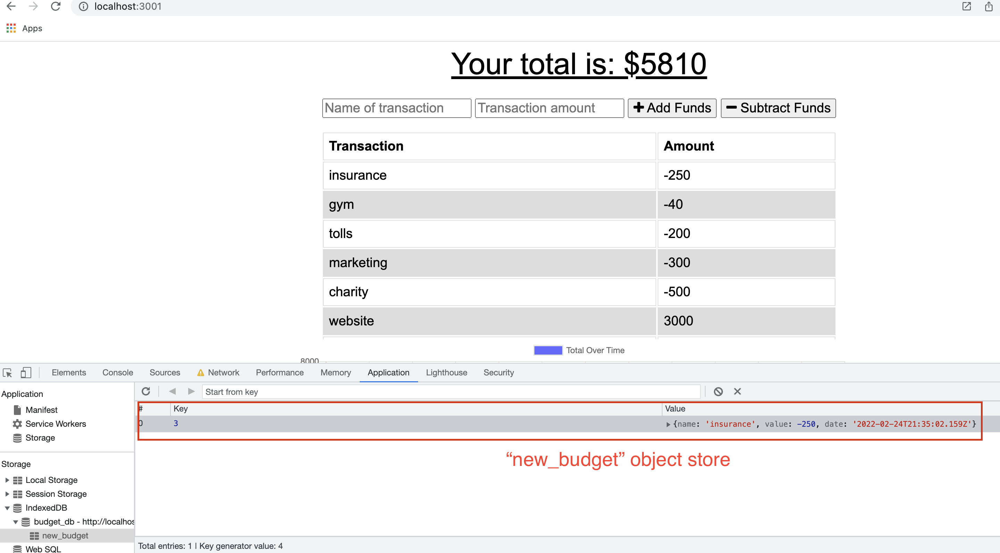
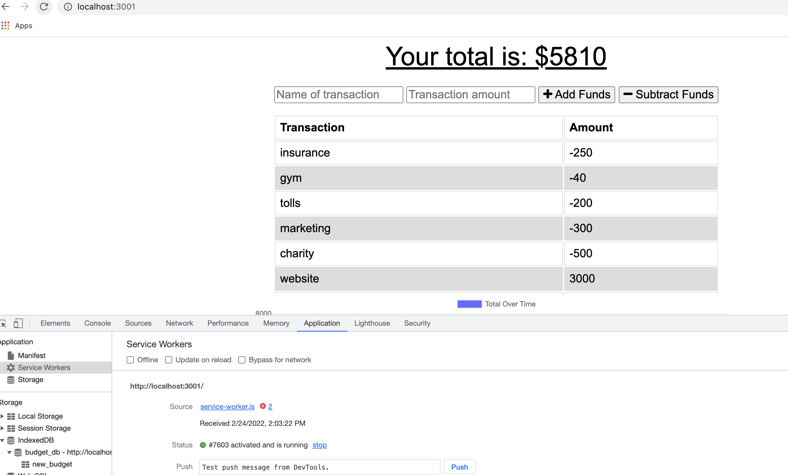

# Budget Tracker
Module 19: Progressive Web Applications (PWA) Challenge

## Description 
This challenge is to update an existing budget tracker application to allow for offline access and functionality. The user will be able to add expenses and deposits to their budget with or without a connection. If the user enters transactions offline, the total should be updated when they're brought back online.

## Table of Contents

* [Usage](#usage)
* [User Story](#userStory)
* [Screenshots](#screenshots)
* [Questions](#questions) 

## Usage 
Giving users a fast and easy way to track their money is important, but allowing them to access that information at any time is even more important. Having offline functionality is paramount to the success of an application that handles users’ financial information.

## User Story
AS AN avid traveler
I WANT to be able to track my withdrawals and deposits with or without a data/internet connection
SO THAT my account balance is accurate when I am traveling 

## Screenshots

Here are some images showing the transaction being saved offline and persisting when back online:

Offline: transaction saved on the object store

Online: Saved transaction

## Questions
If you have any questions about the repo, please send an [email](mailto:andiconner@icloud.com). You can find more of my work at  [my gitub profile page](https://github.com/andiconner)

